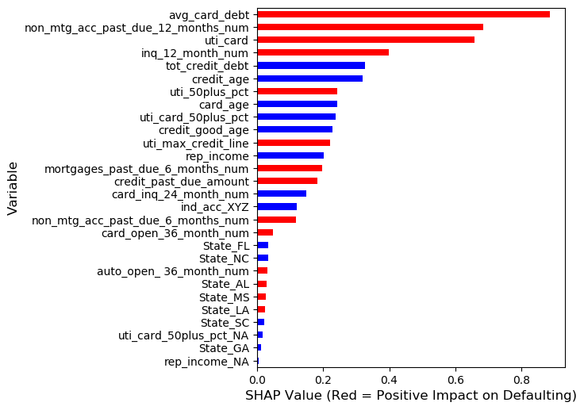

# Wells-Fargo-Anomaly-Detection-Competition

### [Access to Full Report](https://drive.google.com/file/d/15T8OmBw0JUR4cNXvAg5yMq6k8VMvHh_o/view?usp=sharing)


### Data Preprocessing

Imbalanced data, we implemented various techniques of data resampling including; 
Random under-sampling, random over-sampling, SMOTE, ADASYN.

It was determined that the best resampling method was a mixture of random over and under-sampling. Following the distribution below. 


PCA reduction to 15 components and min max scaling was also applied.

#### Removing Outlier Data

Test were conducted to attempt to remove outlier data.

We tried removing outliers by kmeans:


A Gaussian Mixture Model was also tested:


However, it was found that the model preformed best without removing data.


### Model Structure

Implemented nested cross validation for all machine learning models.


### Model Evaluation
```
test_results(model,X_train, y_train, X_test, y_test, name='XGBoost hyperopt')
```

Reports detailed results in the following format:

```
Classification Report
              precision    recall  f1-score   support

     Class 1       0.94      0.88      0.91      4599
     Class 2       0.22      0.41      0.29       401

    accuracy                           0.84      5000
   macro avg       0.58      0.64      0.60      5000
weighted avg       0.89      0.84      0.86      5000
```


### Model Selection and Inference



