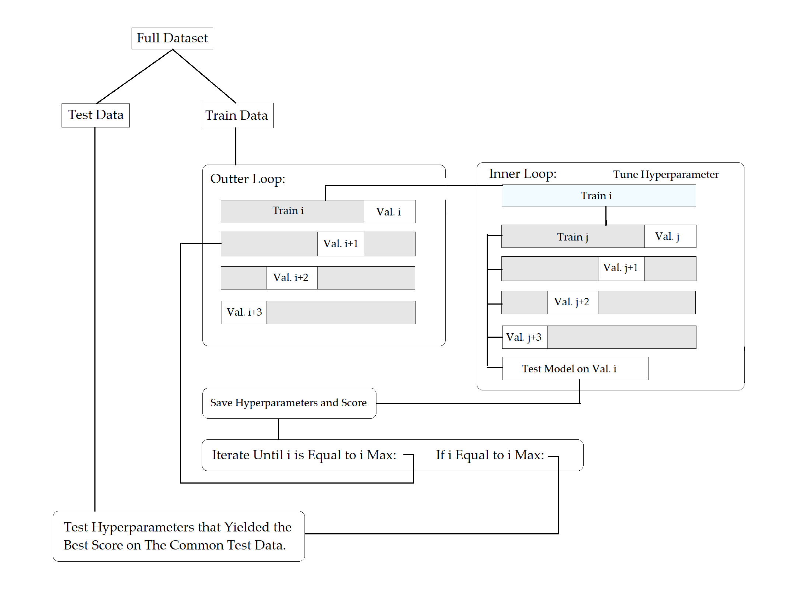

# Wells-Fargo-Anomaly-Detection-Competition

### Model Structure

We use nested cross validation for all machine learning models.



### Model Evaluation
```
test_results(model,X_train, y_train, X_test, y_test, name='XGBoost hyperopt')
```

Reports detailed results in the following format:

```
Classification Report
              precision    recall  f1-score   support

     Class 1       0.94      0.88      0.91      4599
     Class 2       0.22      0.41      0.29       401

    accuracy                           0.84      5000
   macro avg       0.58      0.64      0.60      5000
weighted avg       0.89      0.84      0.86      5000
```


